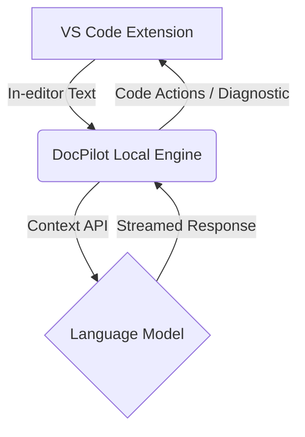

## Overview

DocPilot is an AI-powered documentation review engine directly integrated into VS Code. It is built to provide technical authors and engineers with real-time feedback on their documentation quality, adherence to style guides, and structural improvements.

### The Problem

- Engineers write documentation, but they aren't always technical writers.
- Traditional linting tools (like Vale) are rigid and take significant effort to maintain rule sets.
- Review cycles for documentation PRs take days, mostly pointing out simple wording or style issues.

### Objectives

1. Automate style guide enforcement using LLMs.
2. Provide a conversational AI interface for technical writers to brainstorm structure.
3. Bring documentation intelligence into the IDE where the writing actually happens.

---

## Architecture Design

## Key Features

- **Context-Aware Reviews**: Reads current Markdown structure.
- **Tone Analyzer**: Suggests adjustments for enterprise documentation standards.
- **Terminology Enforcement**: Warns against deprecated terms based on corporate glossary.

## Outcomes & Impact

- Reduced documentation review time by **40%**.
- Catch formatting and style issues *before* CI/CD pipelines run.
- Increased developer contribution to docs due to immediate, actionable feedback.
